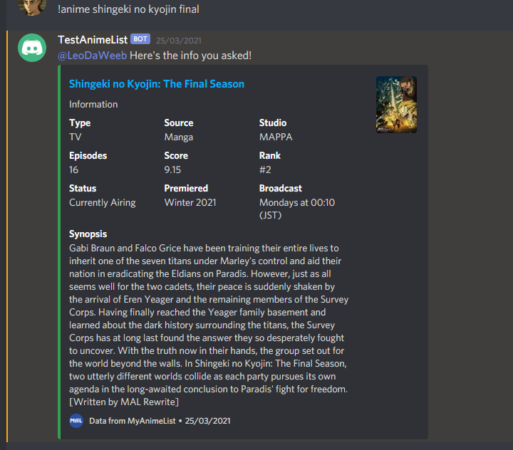

# Anime List

Discord bot that gives information about anime, notifications
for new episodes, and more. It uses the [Jikan-API](https://jikan.moe/)
to fetch anime info and the [GoGoAnime](https://gogoanime.ai/)
website to check for new episodes of currently airing anime.

<h2>Commands</h2>

* `!anime` : Returns information of specified anime. 
**Example use:** `!anime` *Shingeki no Kyojin*

* `!notify` : Notify's you whenever a new episode of specified anime comes out. 
**Example use:** `!notify` *Shingeki no Kyojin*

* `!delete` : Stops sending new episode notifications of specified anime. 
**Example use:** `!delete` *Shingeki no Kyojin*

* `!list` : Returns a list of all the anime on the server that you receive notifications for. 
**Example use:** `!list`

